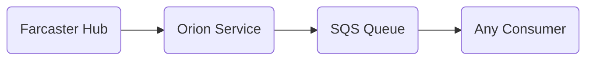

# Orion Queue Pusher

## What is Orion?
Orion is our internal service that takes events and messages from our Farcaster nodes, and pushes them into our SQS queues.

## Why?
Orion allows us to easily consume events in any circumstance or language, without a replacement for hub-nodejs being needed.

Beyond that, it allows us to have one connection/publisher -> many consumers, instead of having to initialize a new connection for every app.

## How it works

## Contributing
This is more of an internal service, but building in public is the name of the game, so it's open-sourced.

If you'd like to contribute, please open up an issue before working on anything.

If a feature request/bug fix/etc.. has been approved, please fork this repo, clone it, and switch to a new branch clearly outlining what your feature does.

Along with that, please use [Conventional Commits](https://www.conventionalcommits.org/en/v1.0.0/) for both your commits & PR title

We don't have a PR template at the moment, so for now just explain what you did, which issue it resolves, etc...
