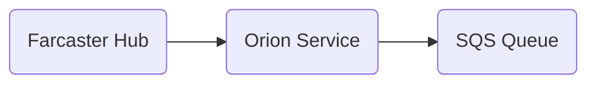

# Orion Queue Pusher

## What is Orion?
Orion is our internal service that takes events and messages from our Farcaster nodes, and pushes them into our SQS queues.

## Why?
Orion allows us to easily consume events in any circumstance or language, without a replacement for hub-nodejs being needed.

Beyond that, it allows us to have one connection/publisher -> many consumers, instead of having to initialize a new connection for every app.

## How it works

